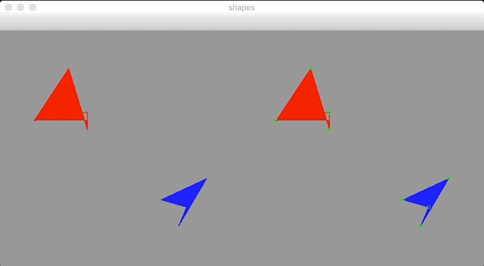

# [`vidstab`](https://github.com/AdamSpannbauer/python_video_stab) explained

A project to demonstrate how video stabilization works in the python package `vidstab`.

### Progress

* created script to generate shaky video & highlight points that would be important to video stabilization
	* script: [`gen_shaky_video.py`](gen_shaky_video.py)
	* output: see below

  

